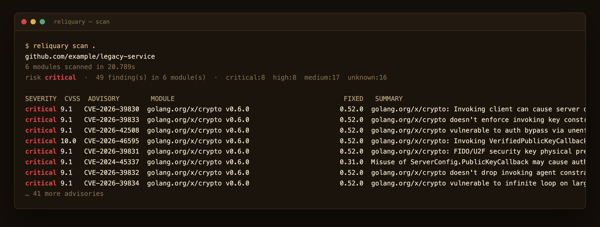
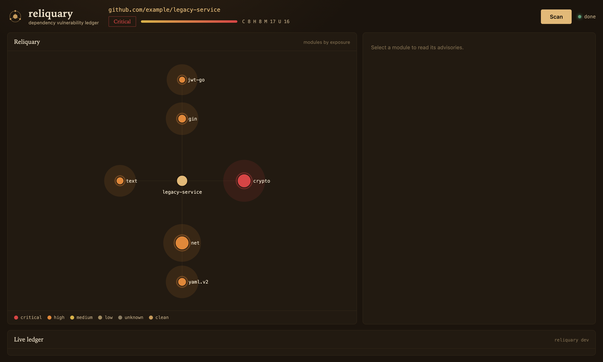
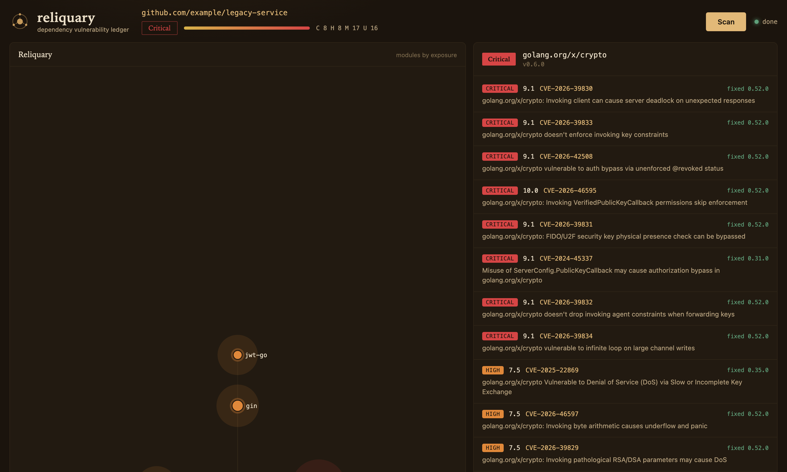
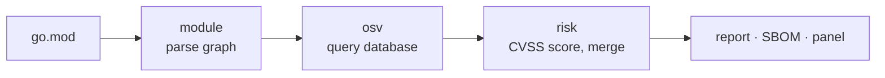

<picture>
  <source media="(prefers-color-scheme: dark)" srcset="docs/assets/wordmark-dark.svg">
  
</picture>

[](https://github.com/cansarihan/reliquary/actions/workflows/ci.yml)
[](https://github.com/cansarihan/reliquary/actions/workflows/codeql.yml)
[](https://goreportcard.com/report/github.com/cansarihan/reliquary)
[](go.mod)
[](LICENSE)

Reliquary reads a Go module, takes an inventory of everything it depends on, and checks each one against the
[OSV](https://osv.dev) database for known vulnerabilities. It computes a CVSS base score for every advisory,
folds duplicate records for the same CVE together, and ranks the dependency graph by exposure so the module
that needs upgrading first is the one that stands out. It also emits a CycloneDX software bill of materials.

One binary with no dependencies outside the standard library and the canonical `go.mod` parser. It talks to
OSV over plain HTTPS and runs the same on Linux, macOS and Windows.

## On the command line

```console
$ reliquary scan .
github.com/example/legacy-service
6 modules scanned in 20.789s
risk critical  ·  49 finding(s) in 6 module(s)  ·  critical:8  high:8  medium:17  unknown:16

SEVERITY  CVSS  ADVISORY        MODULE                       FIXED   SUMMARY
critical  10.0  CVE-2026-46595  golang.org/x/crypto v0.6.0   0.52.0  VerifiedPublicKeyCallback skips enforcement
critical  9.1   CVE-2024-45337  golang.org/x/crypto v0.6.0   0.31.0  Misuse of PublicKeyCallback may cause auth bypass
high      7.5   CVE-2025-22869  golang.org/x/crypto v0.6.0   0.35.0  Denial of service via slow key exchange
```



## The panel

`reliquary serve` hosts a panel that draws the project as a constellation of relics: the module at the centre,
its dependencies orbiting it, each one haloed in the colour and size of its worst advisory. The header tallies
the whole graph and scores its overall risk band.



Selecting a relic opens its advisories — every CVE with its CVSS score, the version that fixes it, and a
one-line summary.



## How scoring works

Reliquary does not invent severities. For each advisory it parses the CVSS v3.1 vector OSV publishes and
computes the base score with the standard formula, then classifies it:

| Band | CVSS base score |
|---|---|
| Critical | 9.0 - 10.0 |
| High | 7.0 - 8.9 |
| Medium | 4.0 - 6.9 |
| Low | 0.1 - 3.9 |

When an advisory carries no CVSS vector, its severity falls back to the database's own qualitative rating, or
`unknown` when there is none. OSV often returns several records for one underlying issue — a GitHub advisory, a
Go vulndb entry, a CVE — so records sharing a CVE are merged, keeping the highest score and any fix version. A
module's grade is the worst advisory affecting it; the project's risk band is the worst grade across the graph.

## How a scan runs



1. `go.mod` is parsed with the canonical parser into the module set, applying `replace` directives and keeping
   the direct/indirect distinction.
2. Every versioned module is sent to OSV in a single batch query; the advisories that match are fetched in
   full and cached.
3. Each advisory is scored and deduplicated by CVE; modules are ranked worst first.
4. Results render as a table or JSON, as a CycloneDX SBOM, or stream to the panel over server-sent events.

## The SBOM

```console
$ reliquary sbom -o bom.json .        # CycloneDX 1.5, components and vulnerabilities
$ reliquary sbom -no-scan .           # components only, no network
```

The document lists every module as a `pkg:golang` component and, unless `-no-scan` is given, attaches the
vulnerabilities found with their CVSS ratings.

## Commands

```console
$ reliquary scan [dir]          # grade a module's dependencies
    -json         print JSON instead of a table
    -t <dur>      OSV query timeout (default 30s)

$ reliquary sbom [dir]          # write a CycloneDX SBOM
    -o <file>     write to a file instead of stdout
    -no-scan      list components without querying vulnerabilities

$ reliquary serve               # host the panel and API over one project
    -dir <dir>       project directory to scan (default .)
    -listen <addr>   listen address (default 127.0.0.1:8080)
    -token <tok>     require a bearer token (or RELIQUARY_TOKEN)
    -no-ui           serve the API without the panel

$ reliquary version
```

## HTTP API

```console
GET  /api/v1/status               build and the directory being served
GET  /api/v1/scans                recent scans, newest first
POST /api/v1/scans                start a scan of the served directory
GET  /api/v1/scans/{id}           one scan with every graded module
GET  /api/v1/scans/{id}/stream    server-sent events for a running scan
```

## Run the demo

The demo serves a deliberately outdated module and grades it against the live OSV database.

```sh
cd reliquary
make demo          # panel at http://127.0.0.1:18140
make demo-down
```

The exact numbers move as new advisories are published; the sample pins old releases of `golang.org/x/crypto`,
`golang.org/x/net` and others, so it always lands in the critical band.

## Build

```sh
make build         # ./bin/reliquary
make test          # unit and integration tests
make race          # tests under the race detector
make lint          # golangci-lint
```

Vulnerability data comes from [OSV](https://osv.dev). Reliquary reads `go.mod` and never runs project code.

## License

MIT. See [LICENSE](LICENSE).
