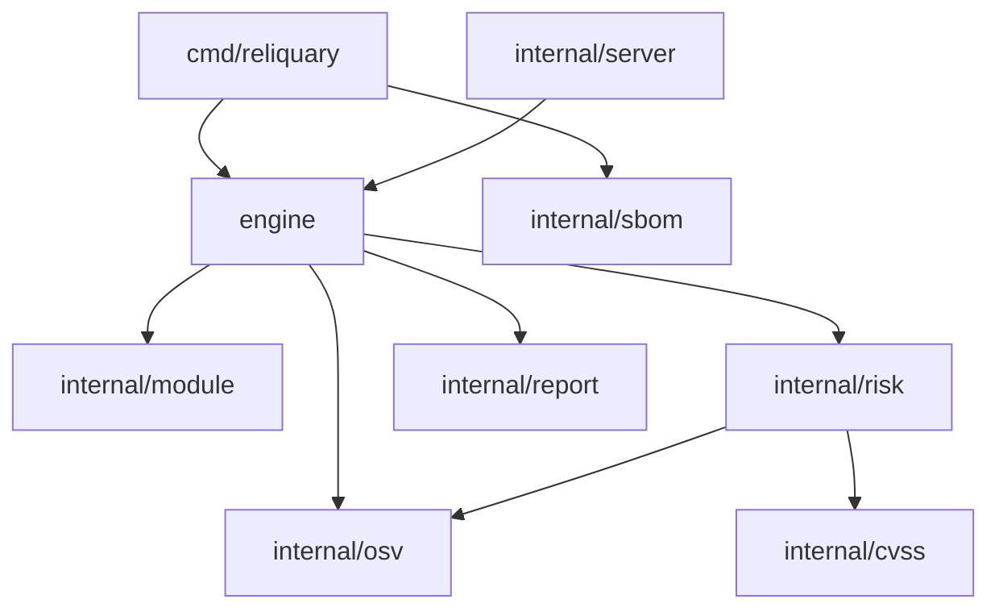

# Architecture

Reliquary is a pipeline: a `go.mod` becomes a set of modules, the modules become a set of advisories, and the
advisories become scored, deduplicated findings. Each stage is a package with one responsibility, and the
`engine` package drives them and turns the result into updates for the command line and the panel.

## Packages

- `internal/module` parses `go.mod` with `golang.org/x/mod/modfile` into the module set, applies `replace`
  directives, and records the direct/indirect distinction. It reads only the manifest; it never runs `go` or
  touches the network.
- `internal/osv` is the OSV client. It sends every versioned module in one `querybatch` request, fetches the
  full record for each advisory id once, and caches it. The `Client` interface lets tests substitute a fake, so
  the whole pipeline is exercised offline.
- `internal/cvss` computes a CVSS v3.1 base score from a vector string using the published formula, and
  classifies a score into a severity level. It is pure arithmetic and is checked against known vectors.
- `internal/risk` turns an OSV advisory into a finding: it scores the CVSS vector, falls back to the database's
  qualitative severity, extracts the fixing version, and merges records that share a CVE. It also aggregates a
  set of findings into a risk index and band.
- `internal/engine` drives the pipeline. It builds the query targets, runs the OSV query, assesses and
  deduplicates each module's advisories, ranks modules worst first, and emits a stream of typed updates.
- `internal/sbom` builds a CycloneDX 1.5 document from the module set and, when present, the findings, writing
  each module as a `pkg:golang` component.
- `internal/report` renders a summary as a table or JSON.
- `internal/server` wraps the engine in an HTTP API and serves the embedded panel. It scans one fixed directory
  chosen at startup, so a request can never point it at an arbitrary path. Each scan keeps a bounded event feed
  the panel follows over server-sent events.
- `internal/logging` is a thin `slog` setup.

## Deduplication

OSV returns a record per advisory database, so one vulnerability in one module can arrive several times — a
GitHub Security Advisory with a CVSS vector, a Go vulndb entry without one, a raw CVE. Findings are keyed by
their CVE (or the advisory id when there is no CVE alias); when a key repeats, the records are merged, keeping
the highest severity and score and filling in a fix version or summary from whichever record has one. This is
why the reported counts are lower than the raw advisory count.

## Testing

`cvss` is checked against published vectors with known scores. `module` parses a fixture manifest including a
`replace` and an indirect requirement. `osv` runs against an `httptest` server that mimics the batch and detail
endpoints. `risk` covers scoring, the qualitative fallback, and merging. `engine` and `server` run the whole
pipeline against a fake OSV client, so grading, ranking, deduplication and the streamed API are all exercised
without a network. Tests run clean under the race detector.
